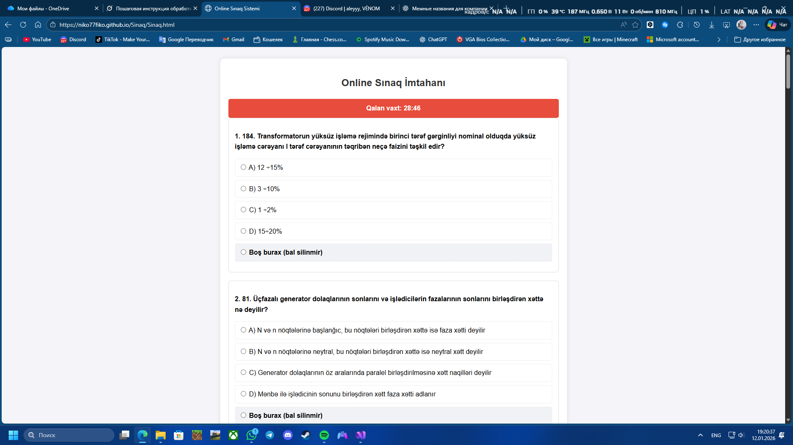

# Sinaq

Онлайн-система для синаг-имтаханов (экзаменационных тестов)

Живой сайт: https://niko77fiko.github.io/Sinaq/Sinaq.html

## Описание

Простая и удобная веб-страница для прохождения онлайн-тестов (sınaq imtahanı).  
Подходит для подготовки к экзаменам по различным предметам (Riyaziyyat, Fizika, Elektrik dövrələri və s.).

### Основные функции
- Таймер экзамена (Qalan vaxt)
- Вопросы с несколькими вариантами ответов (A, B, C, D + Boş burax)
- Классический формат азербайджанских экзаменов
- Простой и читаемый дизайн

## Скриншот работы сайта

(Сделай скриншот своей страницы теста, сохрани как `sinaq-example.png` в корне репозитория и запушь)

## Как запустить локально

1. Скачай репозиторий: git clone https://github.com/NIKO77FIKO/Sinaq.git
2. Открой файл `Sinaq.html` в любом браузере (Chrome, Edge, Firefox и т.д.)

## Планы на развитие
- Добавить JavaScript для автоматической проверки ответов и подсчёта баллов
- Сделать несколько разных тестов (по предметам)
- Добавить выбор сложности и тем
- Красивый дизайн (CSS-анимации, адаптив под мобильные)
- Сохранение результатов в LocalStorage

Готов к сотрудничеству и предложениям!    
Если хочешь помочь — forkни репозиторий и присылай pull request 😊

## Автор
- GitHub: [@Nureli001](https://github.com/Nureli001) [@NIKO77FIKO](https://github.com/NIKO77FIKO) 
- My Telegram: (@Niko66Fiko)
